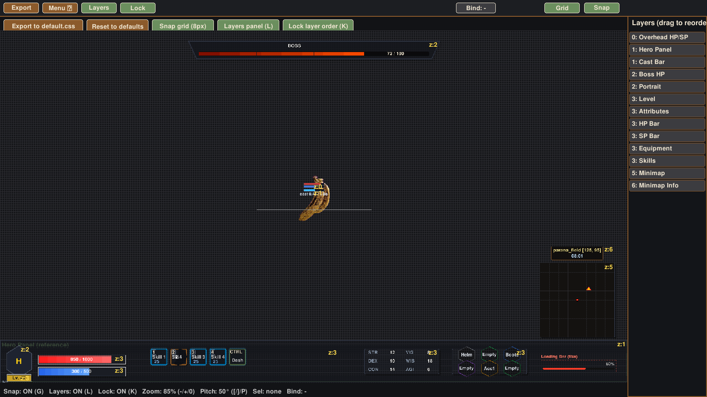

# Caldera

[English](README.md) · **Português** · [日本語](README.ja.md)

Editor visual da HUD da [Eruption Engine](https://github.com/eruptionlabs/eruption-engine).

A HUD da engine é descrita em CSS (`data/hud/default.css`). O Caldera abre esse arquivo, desenha cada widget no lugar em que a engine vai desenhar, e deixa você mover, redimensionar e reordenar tudo com o mouse. Ao exportar, ele grava o CSS de volta e a engine recarrega a HUD sem precisar reiniciar.



## Por que ele é fiel ao jogo

O preview não é um mockup. O Caldera usa as mesmas regras de layout do `CSSLayout` da engine e projeta o personagem com a mesma câmera (FOV 60°, distância e pitch iniciais do jogo) e o mesmo billboard do shader de sprites. Widgets presos ao jogador (`--bind-to-player: 1`) aparecem exatamente onde vão aparecer em cima do sprite, em qualquer zoom e inclinação.

A escala do canvas é igual em X e Y, então a janela pode ter qualquer proporção sem esticar a HUD.

## Requisitos

- Python 3.10 ou mais novo
- pygame 2.5 ou mais novo (o `run.sh` instala num ambiente virtual próprio)
- Um checkout da Eruption Engine

## Como rodar

Dentro da engine, onde ele já vem como submódulo:

```bash
git clone --recurse-submodules https://github.com/eruptionlabs/eruption-engine.git
cd eruption-engine
tools/caldera/run.sh
```

Fora da engine, aponte para ela:

```bash
ERUPTION_ROOT=/caminho/da/eruption-engine ./run.sh
```

Sem `ERUPTION_ROOT`, o Caldera sobe as pastas a partir de onde está até achar o `CMakeLists.txt` da engine.

## Widgets

| Seletor | O que é | Posição relativa a |
|---|---|---|
| `#hero-panel` | Painel inferior | tela |
| `#hero-portrait` | Retrato | painel |
| `#hero-level` | Selo de nível | painel |
| `#hero-hp-bar`, `#hero-sp-bar` | Barras de HP e SP | painel |
| `#skill-slots`, `#attr-matrix`, `#equip-panel` | Slots que o jogo preenche | painel |
| `#overhead-hp-sp` | HP e SP sobre o personagem | jogador |
| `#cast-bar` | Barra de conjuração | jogador ou tela |
| `#boss-hp-bar` | Barra de chefe | tela |
| `#minimap`, `#minimap-info` | Minimapa e caixa de nome do mapa | tela |

Posições relativas à tela ou ao painel são salvas em porcentagem. Widgets presos ao jogador são salvos em pixels a partir da base do sprite e escalam com o zoom da câmera.

## Controles

| Ação | Como |
|---|---|
| Mover um widget | arrastar |
| Redimensionar | arrastar as alças do widget selecionado |
| Ajuste fino | setas (Shift move 10 px) |
| Reordenar camadas | arrastar no painel de camadas, ou Ctrl + PgUp / PgDn |
| Prender ou soltar do jogador | B |
| Snap à grade | G |
| Painel de camadas | L |
| Travar ordem das camadas | K |
| Exportar para `default.css` | E, ou o botão Export |
| Limpar seleção | Esc |
| Zoom da câmera do preview | + e −, 0 volta ao padrão do jogo |
| Inclinação da câmera | [ e ], P volta a 50° |

## Variáveis de ambiente

| Variável | Uso |
|---|---|
| `ERUPTION_ROOT` | Pasta da engine, quando o Caldera está fora dela |
| `CALDERA_WINDOW=1600x900` | Tamanho inicial da janela |
| `CALDERA_VIRTUAL=1280x720` | Resolução de tela emulada (padrão 1920x1080) |
| `CALDERA_SCREENSHOT=saida.png` | Renderiza alguns quadros, salva a imagem e sai. Útil para comparar com uma captura da engine |

Para comparar com o jogo lado a lado, capture a engine com a HUD e renderize o Caldera na mesma resolução:

```bash
ERUPTION_TEST_SWAP_SHOT=jogo.png,300 ERUPTION_TEST_EXIT_FRAME=330 ./eruption-engine --map parana_field
CALDERA_VIRTUAL=1280x720 CALDERA_SCREENSHOT=caldera.png tools/caldera/run.sh
```

## Imagens opcionais

Se existirem na engine, o preview usa `assets/hud/portrait.png` e `assets/hud/skill_1.png` a `skill_4.png`. Sem elas, os slots aparecem vazios. O sprite do personagem vem de `assets/sprites/default.spr` (formato ERUPTSPR) ou, na falta dele, de `default.png`.

## Licença

Apache License 2.0, a mesma da Eruption Engine. O pygame é distribuído sob a LGPL e é instalado à parte pelo `run.sh`.

"Eruption Engine" e o logotipo são marcas da Gdg Soluções Digitais LTDA.
